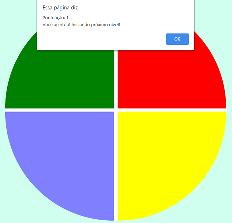

# Genius Game
Pequena modificação do código apresentado no Lab **"Criando seu jogo de memória estilo Genius"**  da [Digital Innovation One](https://digitalinnovation.one).

## Modificações
Para aumentar o nível de dificuldade, cada nível do jogo rotaciona o círculo 90º no sentido anti-horário.

## Instruções
Para iniciar o jogo, abra o `index.html` no seu navegador da web.

Clique nas cores na mesma sequência mostrada no jogo para subir de nível.

## Tecnologias utilizadas
- HTML
- CSS
- Javascript

## Screenshots

